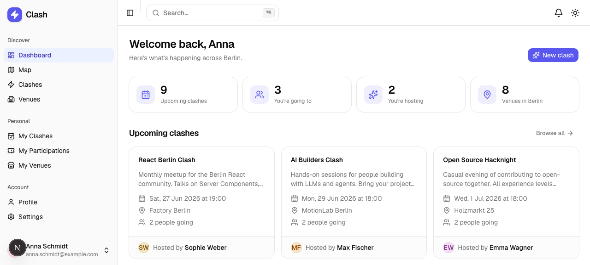
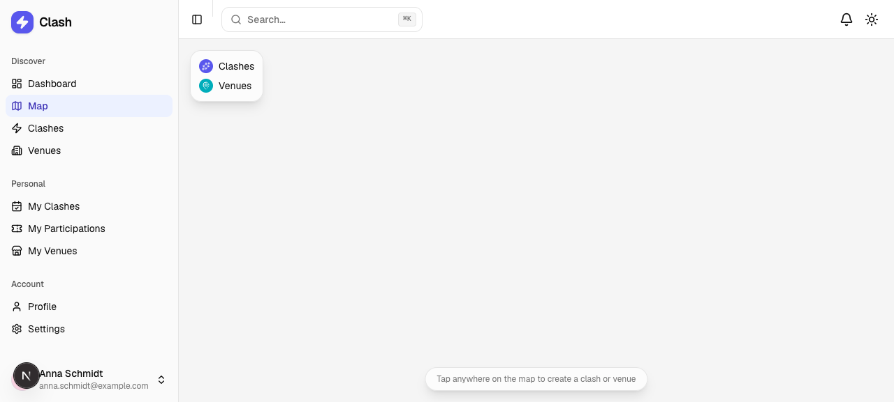
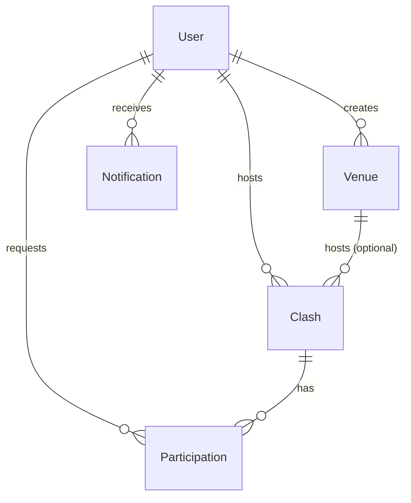

<div align="center">

# ⚡ Clash

**A geospatial social platform for spontaneous meetups across Berlin.**

Discover what's happening on a live map, host your own _clashes_, claim venues, and manage who shows up — all in one place.



</div>

---

## Table of contents

- [What is Clash?](#what-is-clash)
- [Features](#features)
- [Screenshots](#screenshots)
- [Tech stack](#tech-stack)
- [Architecture](#architecture)
- [Data model](#data-model)
- [Project structure](#project-structure)
- [Getting started](#getting-started)
- [Available scripts](#available-scripts)
- [Demo accounts](#demo-accounts)
- [Developer notes](#developer-notes)
- [Scope & limitations](#scope--limitations)

---

## What is Clash?

Clash is a full-stack web app built around a single idea: **the city is the social graph**. Instead of feeds and follower counts, everything is anchored to a place and a time on an interactive map of Berlin.

- A **clash** is an activity — a yoga session, a hackathon, a board-game night — that happens at a location and a moment in time.
- A **venue** is a reusable physical place (a café, a co-working space, a park) that can host many clashes.
- People **join** clashes; hosts **accept or reject** requests; everyone gets **notified** as things happen.

It's a complete product: authentication, a live map, full CRUD for clashes and venues, a participation/approval workflow, profiles with avatar upload, a dashboard, global search, in-app notifications, light/dark themes, and a responsive shell.

---

## Features

### Discover

- **Live map** (OpenStreetMap) centered on Berlin with distinct teardrop pins for clashes and venues, popups that link through to detail pages, and **click-to-create** anywhere on the map.
- **Dashboard** with at-a-glance stats (upcoming clashes, what you're attending, what you're hosting, total venues), upcoming clashes, popular venues, and a recent-activity feed.
- **Global search** across clashes, venues, and people — both as a ⌘K command palette and a dedicated grouped results page.

### Clashes

- Browse, search, filter (upcoming / past / all), and sort (soonest / newest / popular).
- Create and edit clashes with a map location picker, an optional venue (which snaps coordinates), and a date/time.
- Detail page with a mini-map, host info, and a **People** panel split into _Going_ and pending _Requests_.
- **Join / leave** flow with optimistic UI and toasts; hosts get **Edit / Delete** instead.

### Venues

- Browse, search, and sort venues by name, popularity, or recency.
- Create/edit venues with a map picker; see every clash hosted there.
- "Host a clash here" jumps straight into clash creation pre-filled with the venue.

### Participation & approval

- Request to join → host **accepts or rejects** from the Requests tab.
- "My Participations" groups your requests into _Going_, _Awaiting approval_, and _Declined_.
- Each transition emits an in-app notification to the right person.

### Profile & account

- Editable profile (name, bio) with a read-only email.
- **Avatar upload with in-browser crop/zoom** (react-easy-crop) stored as a base64 data URL; deterministic colored initials as a fallback.
- Public profile pages showing a person's hosted clashes and added venues.
- Settings page with **light / dark / system** theme selection and session controls.

### Notifications

- DB-backed notifications shown in a top-bar bell with an unread indicator.
- Mark-one and mark-all-read; clicking through navigates to the related clash or venue.
- Triggered on join requests, accept/reject decisions, and new clashes at your venue.

---

## Screenshots

| Live map                        | Dashboard                             |
| ------------------------------- | ------------------------------------- |
|  |  |

---

## Tech stack

| Layer      | Choice                                                                               |
| ---------- | ------------------------------------------------------------------------------------ |
| Framework  | **Next.js 16** (App Router, React Server Components, Server Actions)                 |
| Language   | **TypeScript** + **React 19**                                                        |
| Database   | **SQLite** via **Prisma 7** with the `better-sqlite3` driver adapter                 |
| UI         | **shadcn/ui** (Radix primitives) + **Tailwind CSS v4**                               |
| Map        | **Leaflet** + **react-leaflet** with OpenStreetMap tiles                             |
| Auth       | Custom sessions — signed JWT cookie via **jose**, passwords hashed with **bcryptjs** |
| Validation | **Zod** schemas shared across forms and Server Actions                               |
| Avatar     | **react-easy-crop** → canvas → base64 data URL                                       |
| Theming    | **next-themes** (light / dark / system)                                              |
| Dates      | **date-fns**                                                                         |
| Toasts     | **sonner**                                                                           |

---

## Architecture

Clash leans on the Next.js App Router's server-first model:

- **Reads** happen in **React Server Components**. Data-access helpers live in `lib/data/*` and call Prisma directly — no API layer in between.
- **Writes** happen through **Server Actions** in `app/actions/*` (`'use server'`). Each action validates input with Zod, enforces authorization, mutates via Prisma, emits notifications, and calls `revalidatePath` to refresh affected views.
- **Auth** is enforced once in the `(app)` route-group layout via `requireUser()`, which redirects unauthenticated visitors to `/login`. A signed JWT is stored in an httpOnly cookie.
- **Client interactivity** (map, command palette, avatar cropper, join/leave controls, theme) is isolated into focused `'use client'` components. Leaflet is loaded with `next/dynamic({ ssr: false })` from inside a client wrapper.

```
Browser ──▶ Server Component (page) ──▶ lib/data/*  ──▶ Prisma ──▶ SQLite
   │                                                       ▲
   └──▶ Client Component ──▶ Server Action (app/actions) ──┘  + revalidatePath / notifications
```

---

## Data model

Five Prisma models (see [`prisma/schema.prisma`](prisma/schema.prisma)). SQLite has no native enums, so `status` and `type` are plain strings with documented values.

- **User** — `name`, unique `email`, `passwordHash`, optional `bio`, optional base64 `avatar`.
- **Venue** — `title`, `description`, `latitude`/`longitude`, `creator`. Hosts many clashes.
- **Clash** — `title`, `description`, `dateTime`, `latitude`/`longitude`, optional `venue`, `creator`.
- **Participation** — links a user to a clash with `status` (`pending` / `accepted` / `rejected`); unique per `[clashId, userId]`.
- **Notification** — `type` (`join` / `accepted` / `rejected` / `venue_clash`), `message`, `read`, and optional `clash` / `venue` / `actor` references.



---

## Project structure

```
app/
  (auth)/                 # Login & register (public)
    login/ register/
  (app)/                  # Authenticated shell (sidebar + top bar)
    dashboard/            # Stats, upcoming clashes, popular venues, activity
    map/                  # Full-screen Leaflet map
    clashes/              # List, detail, new, edit
    venues/               # List, detail, new, edit
    my-clashes/  my-venues/  participations/
    search/               # Grouped global search results
    users/[id]/           # Public profiles
    profile/  settings/
    layout.tsx            # requireUser() guard + app chrome
    loading.tsx error.tsx # Route-level skeleton & error boundary
  actions/                # Server Actions (auth, clashes, venues, profile, …)
  not-found.tsx
components/
  ui/                     # shadcn/ui primitives
  map/                    # Leaflet wrappers & explore map
  clashes/ venues/ profile/ search/ settings/   # Feature components
lib/
  data/                   # Server-only read helpers (Prisma queries)
  generated/prisma/       # Prisma client output
  auth.ts session.ts password.ts   # Auth & sessions
  validation.ts form.ts   # Zod schemas & form helpers
  prisma.ts constants.ts format.ts notify.ts
prisma/
  schema.prisma  seed.ts  migrations/
docs/                     # README art
```

---

## Getting started

### Prerequisites

- **Node.js 20+**
- **npm** (or your preferred package manager)

### Setup

```bash
# 1. Install dependencies (runs `prisma generate` automatically)
npm install

# 2. Create the SQLite database and apply migrations
npm run db:migrate

# 3. Seed demo users, venues, clashes, and notifications
npm run db:seed

# 4. Start the dev server
npm run dev
```

Then open [http://localhost:3000](http://localhost:3000).

### Environment

A `.env` file at the project root provides:

```dotenv
DATABASE_URL="file:./dev.db"               # SQLite database at the project root
SESSION_SECRET="change-me-in-production"   # Used to sign session JWTs
```

---

## Available scripts

| Script               | Description                                           |
| -------------------- | ----------------------------------------------------- |
| `npm run dev`        | Start the development server                          |
| `npm run build`      | Production build                                      |
| `npm run start`      | Run the production build                              |
| `npm run lint`       | Lint with ESLint                                      |
| `npm run db:migrate` | Create/apply Prisma migrations (`prisma migrate dev`) |
| `npm run db:seed`    | Seed the database with demo data                      |
| `npm run db:reset`   | Reset the database and re-run migrations + seed       |
| `npm run db:studio`  | Open Prisma Studio                                    |

---

## Demo accounts

The seed creates **8 users**, all with the password **`test`**. For example:

| Email                       | Password |
| --------------------------- | -------- |
| `anna.schmidt@example.com`  | `test`   |
| `lukas.mueller@example.com` | `test`   |
| `sophie.weber@example.com`  | `test`   |

You can also register a fresh account from `/register`.

---

## Developer notes

This project targets **Next.js 16**, which differs from older patterns:

- `params` and `searchParams` are **Promises** — `await` them in pages.
- `cookies()` / `headers()` from `next/headers` are **async**.
- Mutations use **Server Actions**; refresh data with `revalidatePath`.
- `next/dynamic({ ssr: false })` is only valid inside a `'use client'` component — Leaflet is wrapped accordingly.
- **Tailwind v4** is configured in CSS (`app/globals.css`), with no `tailwind.config.js`.
- The **Prisma client** is generated to `lib/generated/prisma` and instantiated with the `better-sqlite3` adapter.

Conventions:

- Server-only read helpers live in `lib/data/*`; Server Actions live in `app/actions/*`.
- Zod schemas in `lib/validation.ts` are the single source of truth for form + action validation.
- Avatars are stored as base64 data URLs directly in the database (no external storage).

Quality gates (all currently passing):

```bash
npx tsc --noEmit   # type-check
npm run lint       # ESLint
npm run build      # production build
```

---

## Scope & limitations

Intentionally **out of scope** for this build:

- Real-time / WebSocket notifications (notifications are loaded on render).
- OAuth / social login and email delivery.
- External image hosting / CDN (avatars are base64 in the DB).
- Automated test suite and deployment configuration.

---

<div align="center">
<sub>Built with Next.js, Prisma, shadcn/ui, and OpenStreetMap.</sub>
</div>
