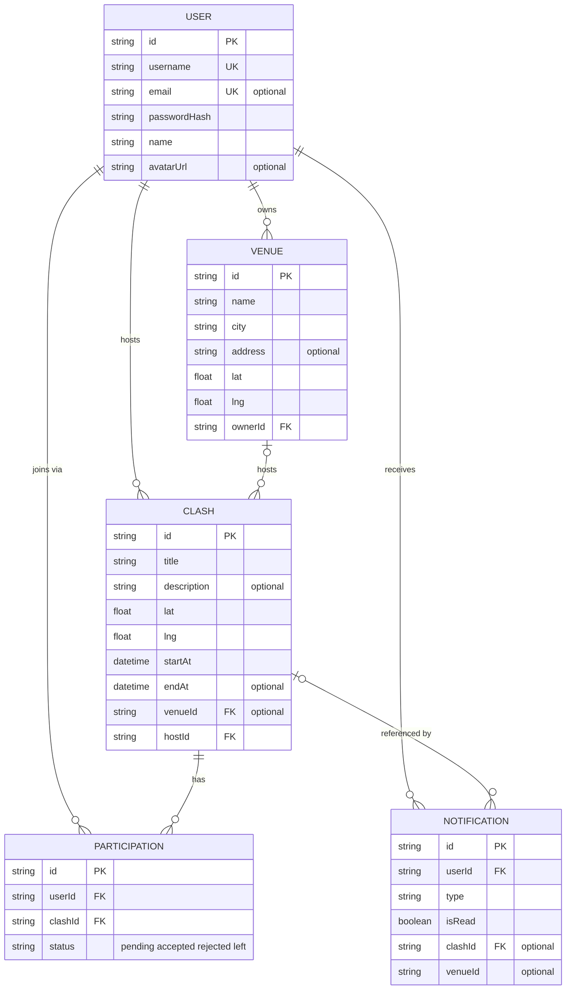
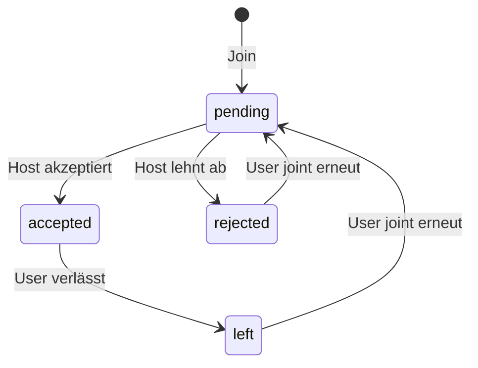

# Clash – Datenmodell

Visualisierung des in `brief.md` beschriebenen und in `prisma/schema.prisma` umgesetzten Entitätsmodells. Quelle der Wahrheit für die genauen Feldtypen und Constraints ist das Prisma-Schema; dieses Dokument dient der Übersicht.

## Entity-Relationship-Diagramm

## Beziehungen im Detail

| Beziehung | Kardinalität | Optionalität |
|---|---|---|
| User → Venue (Owner) | 1 : n | Pflicht auf Venue-Seite (`ownerId` NOT NULL) |
| User → Clash (Host) | 1 : n | Pflicht auf Clash-Seite (`hostId` NOT NULL) |
| Venue → Clash | 1 : n | **Optional** auf Clash-Seite (`venueId` nullable) — Clash kann venue-los sein |
| User ↔ Clash (via Participation) | n : m | Aufgelöst durch `Participation`, max. 1 Zeile pro (User, Clash) |
| User → Notification (Empfänger) | 1 : n | Pflicht auf Notification-Seite (`userId` NOT NULL) |
| Clash → Notification | 1 : n | **Optional** auf Notification-Seite (`clashId` nullable) — Deep-Link, muss nicht gesetzt sein |

Zentrale Eindeutigkeitsbeschränkung: `@@unique([userId, clashId])` auf `Participation` — verhindert doppelte Teilnahme-Anfragen pro (User, Clash)-Paar.

## Participation-Zustandsmodell

Kein direkter Übergang `accepted → rejected` (kein Host-initiiertes "Rauswurf"-Feature). Re-Join nach `rejected`/`left` aktualisiert die bestehende Zeile, statt eine neue anzulegen (wegen des Unique-Constraints).

## Weitere Zustände (nicht persistiert bzw. einfacher Zwei-Zustand)

- **Clash**: kein eigener Status-Wert; upcoming/past wird zur Laufzeit aus `startAt` abgeleitet.
- **Notification.isRead**: `unread → read`, keine Rückkehr vorgesehen.
- **User, Venue**: kein Lebenszyklus-Zustand (kein Soft-Delete/Verifizierung).
